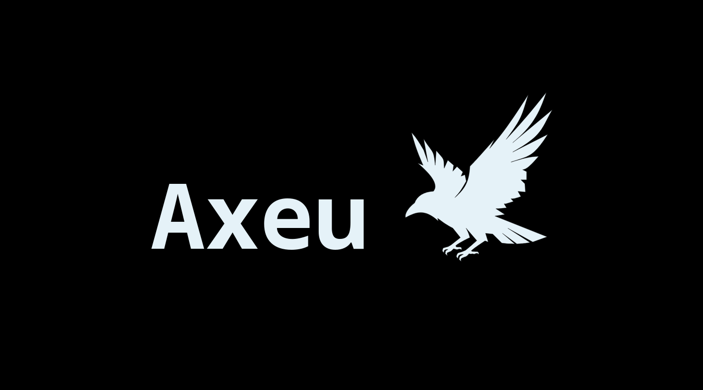

<p align="center">
  
</p>

<h3 align="center">
  ⚠️ <strong>Warning:</strong> Axeu is under active development and <strong>not production-ready</strong>.<br>
  Features and APIs may change without notice.
</h3>

## ✨ Features

- ✅ **Header-only**: Just include and go
- ⚙️ **Modern C++** (C++17+) API design
- 📦 **No external dependencies** beyond Asio
- 🚀 **Blazing-fast routing** with minimal runtime overhead

## 🚀 Quickstart

```cpp
#include "axeu.hpp"

int main() {
  axeu::app app;

  app.get("/", [](const axeu::request &) {
    return axeu::response(200, "Welcome to Axeu!");
  });

  app.get("/hello/<str>", [](const axeu::request &req) {
    auto name = req.get_param<std::string>(0);
    return axeu::response(200, "Hello, " + name + "!");
  });

  app.get("/add/<int>/<int>", [](const axeu::request &req) {
    int a = req.get_param<int>(0);
    int b = req.get_param<int>(1);
    return axeu::response::json(200, {{"sum", std::to_string(a + b)}});
  });

  app.port(8000).run();
}
```

## 🏗️ Building from Source

You need a C++17+ compiler (e.g. `clang++` or `g++`) and **Asio** (either standalone or via Boost).

### Using standalone Asio

```sh
sudo apt install libasio-dev  # or install manually
```

### Compile and run:

```sh
clang++ -std=c++17 -o server main.cpp
./server
```

## 📦 Installation

To install Axeu globally using CMake:

```sh
git clone https://github.com/Srinath10X/Axeu.git && cd Axeu
cmake --build build && sudo cmake --install build
```

This installs the header to your system include path.

## 🧩 API Overview

### App methods

```cpp
app.get(path, handler);
app.post(path, handler);
app.put(path, handler);
app.del(path, handler);
app.port(port_number).run();
```

### Path parameters

Use `<int>` or `<str>` in route paths:

- `/user/<int>` → casts to `int`
- `/hello/<str>` → casts to `std::string`

## 📜 License

Axeu is licensed under the **Apache License 2.0**.  
Use it freely in personal, academic, or commercial projects.

## 🙏 Acknowledgements

Inspired by:

- [Crow](https://github.com/CrowCpp/Crow)
- [Express.js](https://expressjs.com/)

Happy hacking! 🧠⚙️
